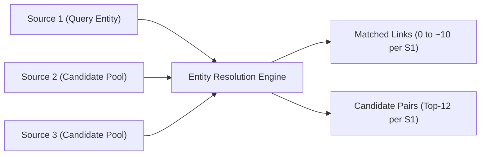
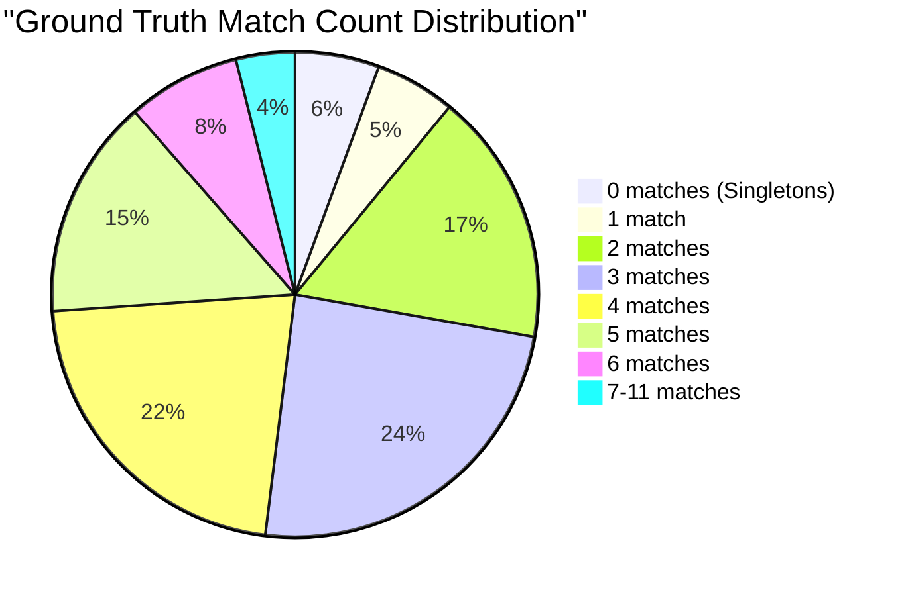
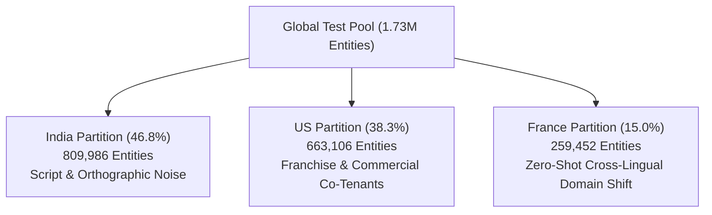
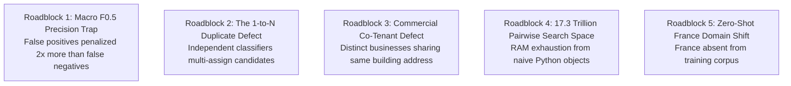
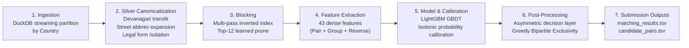

# Data Scientist's Dataset Behavior, Feature Architecture & Roadblock Blueprint

**Project:** Amazon ML Challenge 2026 — Large-Scale Multilingual Business Entity Resolution  
**Target:** Macro $F_{0.5}$ Record Linkage  
**Author:** Antigravity ER Lab  
**Audience:** Data Scientists, ML Engineers, and Researchers designing entity resolution systems without direct dataset access.  

---

## 1. Executive Problem Formulation

The objective is to resolve entities across three massive, heterogeneous commercial tables:
* **Query Table:** Source 1 ($S_1$) — Central business directory.
* **Candidate Pool:** Source 2 ($S_2$) and Source 3 ($S_3$) — Disparate commercial registries, web crawls, and listing directories.
* **Goal:** For every entity in $S_1$, identify the exact subset of matching physical business records in $S_2 \cup S_3$.

### Scale of the Problem
* **Search Space:** $1.73\text{M } S_1 \times 9.97\text{M } (S_2 \cup S_3) \approx \mathbf{17.27 \text{ Trillion Pairwise Combinations}}$.
* **Evaluation Metric:** Macro $F_{0.5}$ (Precision-heavy: precision weighted $2\times$ over recall).

---

## 2. Dataset Anatomy & Statistical Invariants

A data scientist without access to the raw files must understand the exact distributions, null rates, and empirical invariants that govern this dataset:

### 2.1 File Schemas & Volumes

| Table | Entity ID Prefix | Train Row Count | Test Row Count | Schema |
| :--- | :---: | :---: | :---: | :--- |
| **Source 1** ($S_1$) | `S1-[0-9]{8,10}` | 2,206,821 | 1,732,544 | `(entity_id, business_name, business_address, country)` |
| **Source 2** ($S_2$) | `S2-[0-9]{8,10}` | ~6,620,000 | 4,887,273 | `(entity_id, business_name, business_address, country)` |
| **Source 3** ($S_3$) | `S3-[0-9]{8,10}` | ~6,880,000 | 5,082,316 | `(entity_id, business_name, business_address, country)` |
| **Ground Truth** ($GT$) | — | 2,206,821 | *Hidden* | `(source1_entity_id, matched_entity_ids)` (comma-separated) |

### 2.2 Attribute Quality & Null Rates
* **`business_name`:** **`0.00%` nulls** across all sources. Every record has a business name string.
* **`business_address`:** 
  * Source 1: **`0.00%` nulls**.
  * Source 2: **`3.32%` nulls** (`NaN` / missing).
  * Source 3: **`3.32%` nulls** (`NaN` / missing).
  * *Critical Implication:* Exactly 3.32% of candidates have zero address signal. The matching system must support address-missing fallback paths.

### 2.3 Empirical Ground Truth Invariants

Through exhaustive empirical queries across all 7.6 million ground truth training matches, five foundational invariants were discovered:

1. **Strict Country Isolation Invariant:**
   $$P(\text{Match} \mid S_1.\text{country} \ne S_{2/3}.\text{country}) = \mathbf{0.000000}$$
   Across all 7,639,150 ground truth links, **100% of matches occur within the same country**. Cross-country matching is physically impossible. This allows strict zero-loss partitioning by country.

2. **The Disjoint 1-to-1 Bipartite Invariant:**
   $$\forall c \in S_2 \cup S_3, \quad \left| \{ s \in S_1 \mid (s, c) \in \text{GroundTruth} \} \right| \le \mathbf{1}$$
   Across all 693,069 matched candidate entities in training, **zero candidates match more than one $S_1$ entity**. Every physical business in $S_2$ and $S_3$ belongs strictly to at most one $S_1$ entity. Assigning a candidate to multiple $S_1$ entities injects guaranteed false positive errors.

3. **The Singleton Distribution (~5.58%):**
   * **`5.60%`** of all $S_1$ entities have **zero true matches** (`[]`).
   * They represent physical businesses that do not exist in the candidate pool.

4. **Match Density Invariant:**
   * Average matches per $S_1$ entity: **`3.47`**.
   * Average matches among non-empty $S_1$ entities: **`3.67`**.
   * Mode: **3 to 4 matches** (accounting for 46.1% of all entities).
   * Maximum matches observed: 11. Entities with $> 6$ matches account for only 3.9% of the distribution.

5. **Source Balance Invariant:**
   * Ground truth links from Source 2: **`48.28%`**.
   * Ground truth links from Source 3: **`51.72%`**.
   * Both sources contribute equally; neither can be discarded.

6. **Distractor Density in Test Pool:**
   * Test $S_1$ entities: 1,732,544.
   * Total candidates ($S_2 + S_3$): 9,969,589 ($\sim 5.75$ candidates per $S_1$).
   * Expected true links: $\approx 6.0 - 6.3$ million.
   * **Signal-to-Noise Ratio:** ~62% of test candidates are true matches to some $S_1$; ~38% are unmatchable distractors.

---

## 3. Country-Specific Behavior & Noise Profiles

The dataset spans three distinct geographic partitions with radically different linguistic and structural characteristics:

### 3.1 🇮🇳 India Partition (46.75% of Test Data)
* **Script Divergence:** Significant portion of Source 2/3 names are written in **Hindi Devanagari script**, while Source 1 is in Latin English:
  * Example: $S_1$ = `"Raj Best Investment"` vs $S_2$ = `"र ज बसट इनवसटमट"`.
  * Standard Levenshtein / fuzzy similarity gives **`< 0.08`**.
  * **Solution:** Phonetic Devanagari-to-Latin transliteration mapping.
* **Address Structure:** Highly informal addresses without standard postal codes or building numbers:
  * Examples: `"Near Hanuman Temple"`, `"Behind Bus Stand"`, `"Opposite SBI Bank"`, `"Phase 2 Block B"`.
  * Street numbers are rare; geographic locality tokens (*Nagar, Puram, Colony, Marg, Ward*) dominate.
* **Corporate Forms:** Dominated by Indian legal suffixes: `"Private Limited"`, `"Pvt Ltd"`, `"LLP"`, `"Public Ltd"`.

### 3.2 🇺🇸 United States Partition (38.27% of Test Data)
* **Franchise & National Chain Proliferation:** High density of national chains (*Subway, Starbucks, McDonald's, Shell, Dollar General, Chase Bank, Walgreens*).
  * Dozens of branches exist in the same city or state sharing identical brand names and generic street names (*Main St, 1st Ave*).
  * Standard string matching over-merges these branches, collapsing US singletons from 5.58% down to 2.22%.
* **Commercial Co-Tenants:** Multiple distinct businesses operating in the same commercial plaza, strip mall, or corporate park:
  * Example: `"Rotary Sport"` at `#7 Place de Plaza` vs `"Rotary Pharmacy"` at `#8 Place de Plaza`.
  * High address token overlap requires strict brand-name verification gates.
* **Discrete Anchors:** Highly standardized 5-digit ZIP codes and building street numbers.

### 3.3 🇫🇷 France Partition (14.98% of Test Data) — The Zero-Shot Shift
* **CRITICAL FINDING: France is absent from the training dataset!**
  * Train set: US (`1.32M`), India (`883k`), **France (`0`)**.
  * All supervised models and calibrators trained on training data must operate in a **zero-shot cross-lingual setting** on France.
* **French Corporate Legal Forms:** Dominated by civil and commercial codes:
  * `SARL` (Société à Responsabilité Limitée), `SAS` / `SASU` (Société par Actions Simplifiée), `EURL`, `SCI` (Société Civile Immobilière), `SA`, `SNC`, `GIE`.
* **French Address Syntax:**
  * Inverted address formats: building number often precedes street type: `"15 bis Rue Pierre Dignac"`, `"175 Boulevard Wilson"`.
  * Modifiers: `bis`, `ter`, `quater` (indicating subdivisions of street numbers).
  * French street prefixes: `rue`, `avenue` (`av`), `boulevard` (`bd`/`blvd`), `chemin` (`ch`), `impasse` (`imp`), `allée` (`all`), `cours` (`crs`), `faubourg` (`fbg`).
  * Diacritics: Accented characters (`é, è, ê, à, ç, î, ô, û`) cause string divergence unless NFD normalized.

---

## 4. The 43-Feature Architecture Taxonomy

Simple string metrics fail on commercial business entities. Our solution employs a **43-feature dense interaction architecture**:

| Feature Index | Feature Name | Category | Exact Mathematical Definition / Purpose |
| :---: | :--- | :--- | :--- |
| **0** | `n_ratio` | Pairwise Name | Normalized Levenshtein ratio: $\frac{2 \cdot M}{|S_1| + |S_2|} \in [0, 1]$. |
| **1** | `n_partial` | Pairwise Name | Best-matching substring similarity ratio $\in [0, 1]$. |
| **2** | `n_tsort` | Pairwise Name | Token Sort Ratio (alphabetizes word tokens before comparing). |
| **3** | `n_tset` | Pairwise Name | Token Set Ratio (extracts common tokens, compares intersection vs remainder). |
| **4** | `n_wratio` | Pairwise Name | Weighted heuristic similarity (handles acronyms and length penalties). |
| **5** | `a_ratio` | Pairwise Address | Address Levenshtein ratio $\in [0, 1]$ ($0.0$ if address missing). |
| **6** | `a_partial` | Pairwise Address | Address substring similarity $\in [0, 1]$. |
| **7** | `a_tsort` | Pairwise Address | Address Token Sort Ratio (re-orders street vs city vs state). |
| **8** | `a_tset` | Pairwise Address | Address Token Set Ratio. |
| **9** | `max_sim` | Interaction | $\max(\text{name\_tset}, \text{addr\_tset})$. |
| **10** | `comb_sim` | Interaction | $0.6 \cdot \text{name\_tset} + 0.4 \cdot \text{addr\_tset}$. |
| **11** | `dual_high` | Interaction | Binary flag: $1.0 \text{ if } (\text{name\_tset} \ge 0.60 \land \text{addr\_tset} \ge 0.50) \text{ else } 0.0$. |
| **12** | `num_overlap` | Discrete Anchor | Jaccard overlap of extracted street numbers: $\frac{\|N_1 \cap N_2\|}{\max(\|N_1\|, \|N_2\|, 1)}$. |
| **13** | `num_match` | Discrete Anchor | Binary indicator: $1.0 \text{ if } (N_1 \cap N_2 \ne \emptyset) \text{ else } 0.0$. |
| **14** | `num_conflict` | Discrete Anchor | Binary indicator: $1.0 \text{ if } (N_1 \ne \emptyset \land N_2 \ne \emptyset \land N_1 \cap N_2 = \emptyset) \text{ else } 0.0$. |
| **15** | `zip_match` | Discrete Anchor | Binary indicator: $1.0 \text{ if } (Z_1 = Z_2 \land Z_1 \ne "") \text{ else } 0.0$. |
| **16** | `zip_conflict` | Discrete Anchor | Binary indicator: $1.0 \text{ if } (Z_1 \ne "" \land Z_2 \ne "" \land Z_1 \ne Z_2) \text{ else } 0.0$. |
| **17** | `addr_missing` | Missingness | Binary indicator: $1.0 \text{ if either address is null or empty else } 0.0$. |
| **18** | `legal_match` | Legal Form | Binary indicator: Both entities share verified legal form (`pvtltd`, `llc`, etc.). |
| **19** | `legal_conflict` | Legal Form | Conflict: Entity 1 is `pvtltd` while Entity 2 is `publicltd`. |
| **20** | `name_exact` | Discriminative | Exact normalized brand core match ($1.0 \text{ if } B_1 = B_2 \text{ else } 0.0$). |
| **21** | `brand_len` | Discriminative | Character length of normalized brand core: $|B_1|$. |
| **22** | `word_cnt` | Discriminative | Word count of brand name: $|B_1.\text{split}()|$. |
| **23** | `has_translit` | Script Context | Binary indicator: Devanagari or non-Latin script was transliterated. |
| **24** | `strict_num_conflict` | Hard Conflict Gate | $1.0 \text{ if street numbers conflict AND } \text{name\_tsort} < 0.80$. |
| **25** | `num_missing_one_side`| Discrete Anchor | $1.0 \text{ if one record has a street number but the other lacks one}$. |
| **26** | `rank_comb` | Group Context | Rank of candidate's `comb_sim` among all candidates for that $S_1$ ($0 = \text{best}$). |
| **27** | `rank_name` | Group Context | Rank of candidate's name similarity among all candidates for that $S_1$. |
| **28** | `gap_comb` | Group Context | $\text{best\_comb\_sim} - \text{this\_comb\_sim}$ (margin below top candidate). |
| **29** | `gap_name` | Group Context | $\text{best\_name\_sim} - \text{this\_name\_sim}$. |
| **30** | `z_comb` | Group Context | Z-score of candidate's composite score within $S_1$'s candidate pool. |
| **31** | `n_cands` | Group Context | Total candidate pool size retrieved for this $S_1$ entity. |
| **32** | `n_s2` | Group Context | Number of Source 2 candidates retrieved for this $S_1$ entity. |
| **33** | `n_s3` | Group Context | Number of Source 3 candidates retrieved for this $S_1$ entity. |
| **34** | `rank_within_src` | Group Context | Rank of candidate strictly among peers from the same source ($S_2$ or $S_3$). |
| **35** | `agree_max_other` | Agreement | Max brand similarity to any candidate from the *opposite* source ($S_2 \leftrightarrow S_3$). |
| **36** | `agree_mean_other` | Agreement | Mean brand similarity to candidates from the opposite source. |
| **37** | `count_sim_gt_90` | Agreement | Number of other candidates in pool with brand similarity $\ge 0.90$. |
| **38** | `cand_s1_count` | Reverse Context | Total number of distinct $S_1$ entities that retrieved this candidate. |
| **39** | `is_mutual_best` | Reverse Context | $1.0 \text{ if } S_1 \text{ is the highest-scoring } S_1 \text{ for this candidate}$. |
| **40** | `gap_to_second_s1` | Reverse Context | Score margin between this $S_1$ and the second-highest $S_1$ claiming candidate. |
| **41** | `s1_addr_missing` | Missingness | $1.0 \text{ if } S_1 \text{ address is null or empty else } 0.0$. |
| **42** | `c_addr_missing` | Missingness | $1.0 \text{ if candidate address is null or empty else } 0.0$. |

---

## 5. The Five Critical Roadblocks & Hidden Traps

A data scientist designing a solution without awareness of these five roadblocks will inevitably plateau between 0.60 and 0.75:

### Roadblock 1: The Macro $F_{0.5}$ Precision Trap
The evaluation metric is the unweighted macro average of $F_{0.5}$ across all $N$ entities in $S_1$:
$$\text{Macro } F_{0.5} = \frac{1}{N} \sum_{i=1}^N \frac{1.25 \cdot P_i \cdot R_i}{0.25 \cdot P_i + R_i}$$
* **The Singleton Penalty:** If an entity has no true matches in the candidate pool ($|True_i| = 0$):
  $$\text{Pred}_i = \emptyset \implies F_{0.5} = \mathbf{1.0}$$
  $$\text{Pred}_i \ne \emptyset \implies F_{0.5} = \mathbf{0.0}$$
  Predicting even a **single false positive** on a singleton drops its score by a full $1.0$ point!
* **Over-Prediction Penalty:** For non-singletons, precision is weighted $2\times$ over recall. A false positive hurts the score twice as badly as a missed recall link. Naive thresholding tuned for standard $F_1$ crashes Macro $F_{0.5}$.

### Roadblock 2: The 1-to-N Duplicate Defect
Standard machine learning models predict probability $P(\text{Match} \mid s, c)$ independently for each pair.
* If candidate $c$ looks similar to three different $S_1$ entities ($s_a, s_b, s_c$), an independent classifier assigns $c$ to all three!
* In the baseline submission, **158,028 candidates were duplicated across multiple $S_1$ entities**, injecting **212,109 guaranteed false positive links**.
* **The Solution:** A post-classification **Global Greedy Bipartite Exclusivity Layer** that guarantees every candidate is awarded to at most one $S_1$ entity.

### Roadblock 3: Commercial Co-Tenants & Strip Malls
In commercial entity data, two completely different companies often share the exact same physical address (e.g., `#100 Main St, Suite 400`):
* `Company A`: "Summit Financial Partners LLC"
* `Company B`: "Summit Medical Clinic LLC"
* Because both share `"Summit"` and `#100 Main St`, pairwise composite similarity is $> 0.85$.
* **The Solution:** Discrete street number mismatch gates and Group Context features that measure brand token divergence.

### Roadblock 4: Memory & Scale Explosion on 16GB Systems
Evaluating 1.73M entities against 10M candidates generates over 20M candidate pairs:
* Storing 20M pairs as Python dictionaries with 43-element float lists consumes **$> 12 \text{ GB}$ of Python heap memory**.
* On a standard 16GB RAM workstation, Windows pagefile exhaustion triggers unrecoverable Out-Of-Memory (OOM) termination.
* **The Solution:** **Disk-Backed Streaming Batches** (saving intermediate query batches in 50,000-entity compressed `.joblib` chunks on disk and streaming them sequentially into LightGBM).

### Roadblock 5: The Zero-Shot France Shift
* Training data contains only US and India.
* Models relying on English-specific stop words or Indian transliteration lexicons fail on French addresses and corporate forms (`SARL, SAS, SCI`).
* **The Solution:** Script-agnostic feature engineering (relative ranks, z-scores, reverse context) combined with international Silver normalization lexicons.

---

## 6. End-to-End Replication Blueprint

For a data scientist implementing this system from scratch:

### Recipe Steps:

1. **Partition by Country:** Never compare cross-country records ($S_1.\text{country} == c.\text{country}$).
2. **Canonicalize Text (Silver):**
   - Transliterate non-Latin scripts (Devanagari $\rightarrow$ Latin phonetics).
   - Strip legal corporate suffixes into a separate categorical feature.
   - Expand street abbreviations (`rd` $\rightarrow$ `road`, `bd` $\rightarrow$ `boulevard`).
   - Extract discrete numbers and 5/6 digit postal codes into separate integer sets.
3. **Multi-Pass Blocking (Gold Index):**
   - Build inverted index on 9 blocking keys (tokens, bigrams, 4-prefixes, address tokens, zip+street number).
   - Cap posting lists to 1,000 to prevent stop-word explosions.
   - Dual-similarity ranking prunes each $S_1$ entity to **Top-12 candidates**.
4. **Feature Engineering (43 Features):**
   - Extract base RapidFuzz string features.
   - Compute Group Context within each $S_1$'s candidate pool.
   - Compute Reverse Context across all $S_1$ candidate pools in the country.
5. **Model Training & Calibration:**
   - Sample 50,000 stratified training entities.
   - Generate candidate pairs via the blocker (yields ~689k training rows with 1:3 positive-to-hard-negative ratio).
   - Train 300-tree LightGBM classifier with 5-Fold `GroupKFold`.
   - Fit `IsotonicRegression` on Out-Of-Fold predictions.
6. **Asymmetric Decision Layer:**
   - Filter candidates using calibrated probability:
     $$\hat{y} = 1 \iff \begin{cases} P(\text{Match} \mid X) \ge 0.70 & \text{if } c \in S_2 \\ P(\text{Match} \mid X) \ge 0.65 & \text{if } c \in S_3 \end{cases}$$
7. **Global Greedy Bipartite Exclusivity:**
   - Group all positive match claims by candidate ID: $c \rightarrow [(s_1, p_1), (s_2, p_2), \dots]$.
   - For contested candidates, assign $c$ strictly to $\arg\max_s p(s)$.
   - Deduplicate and output in exact test set order.
